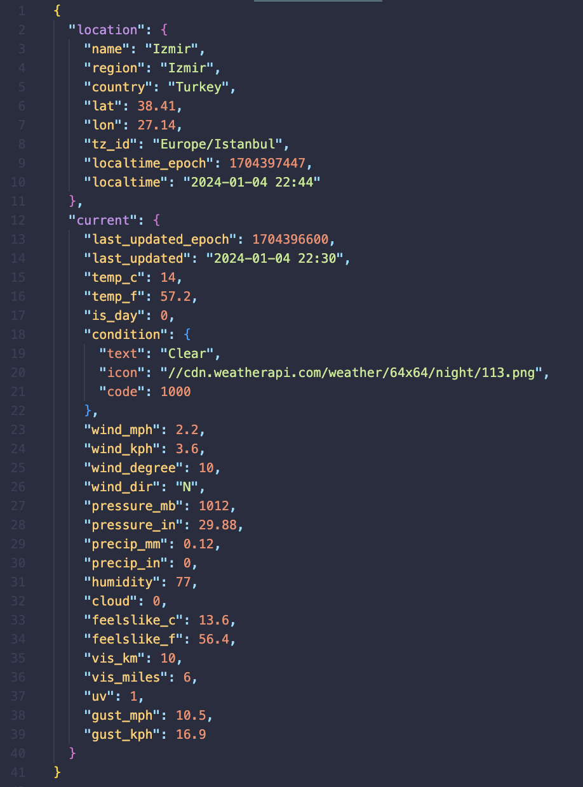
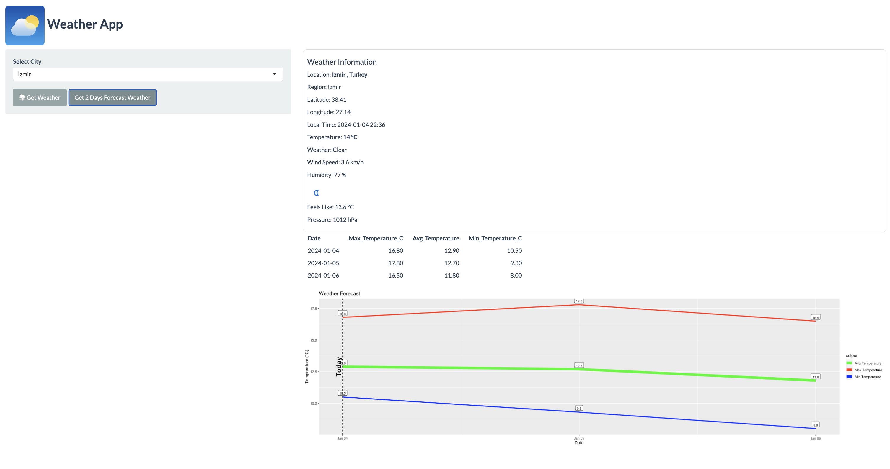

## Giriş

Projede <a href="https://rapidapi.com/">RapidApi.com</a> üzerinden <a href="https://rapidapi.com/weatherapi/api/weatherapi-com/">WeatherAPI.com</a> API kullanılarak anlık hava durumu ve 2 gün'e kadar hava durumu tahmini yapmaktadır.

-   Türkiyede bulunan 81 il baz alınmıştır.
-   R Shiny kullanılarak bir web uygulaması haline getirilmiştir.

## 

------------------------------------------------------------------------

## R Shiny

Shiny, R kullanıcılarına, hem sunucu tarafı mantığı hem de istemci tarafı arayüzü için R kodunu kullanarak minimal çaba ile etkileşimli web uygulamaları oluşturma imkanı sağlar.

Shiny'yi kullanabilmek için R'da shiny paketini yüklemeniz gerekiyor. Eğer henüz yüklü değilse, R konsolunda aşağıdaki komutu kullanarak yükleyebilirsiniz: `install.packages("shiny")`

Shiny paketi, kullanıcı arayüzünün (UI) altındaki R kodundaki değişikliklere tepki veren reaktif web uygulamaları oluşturmak için fonksiyonlar ve araçlar sağlar.

------------------------------------------------------------------------

## R Shiny'nin temel özellikleri;

-   Reaktif Programlama: Shiny, reaktif programlama prensiplerine dayanır. Bu, bir uygulamanın kullanıcı etkileşimlerine anında tepki verebilmesini sağlar. Kullanıcı bir giriş yaparsa veya bir seçenek değiştirirse, uygulama otomatik olarak güncellenir.

-   UI (Kullanıcı Arayüzü): Shiny uygulamalarında kullanıcı arayüzü tanımlamak oldukça kolaydır. R kodu kullanarak düzeni, giriş formları, grafikleri ve diğer öğeleri belirleyebilirsiniz.

------------------------------------------------------------------------

-   Server Logic (Sunucu Mantığı): Kullanıcı arayüzü ile ilişkilendirilmiş olan sunucu mantığı, kullanıcının etkileşimlerine nasıl yanıt verileceğini belirler. R kodu kullanarak işlemler gerçekleştirilir ve sonuçlar kullanıcı arayüzüne yansıtılır.

-   Grafik ve Veri Görselleştirme: Shiny, R'deki grafik paketleri ile entegre bir şekilde çalışır. Bu nedenle, uygulamalarınızda istediğiniz türden grafik ve veri görselleştirmelerini kolayca kullanabilirsiniz.

------------------------------------------------------------------------

-   Modüler Tasarım: Shiny uygulamalarını modüler bir şekilde tasarlamak mümkündür. Bu, büyük ve karmaşık uygulamalar geliştirmenizi kolaylaştırır.

------------------------------------------------------------------------

## R ile API Entegrasyonu

R dilinde HTTP istekleri yapmak için `httr` paketi oldukça kullanışlıdır. API'ye GET HTTP istekleri göndermek için bu paket kullanılmıştır.

-   GET isteği örneği response \<- GET("<https://api.example.com/data>")

API anahtarı için dökümantasyondan yararlanarak. API Key ve Host kullanılmıştır.

Şu anki hava durumu ve 2 günlük hava tahmini için iki tane API isteği oluşturulmuş ve kullanılmıştır.

------------------------------------------------------------------------

API response isteklerinde gelen JSON veya XML verisi `content(response, "parsed")` ile uygun R veri yapısına dönüştürülür.

## UI için Kullanılan Bileşenler

1.  fluidPage: Shiny uygulaması için duyarlı responsive bir sayfa oluşturur. Esnek ve duyarlı bir düzen sağlaması nedeniyle Shiny uygulamaları oluşturmak için yaygın bir tercihtir.

2.  sidebarLayout: Bir ana panel ve bir kenar paneli içeren bir düzen oluşturmak için kullanılır.

3.  selectInput: Kullanıcıya açılır menü (drop-down menu) de seçim yapma olanağı sunan bir giriş alanıdır.

4.  actionButton: Kullanıcının bir eylemi başlatmasını sağlayan bir butondur.

------------------------------------------------------------------------

1.  textOutput: Metin tabanlı çıktı göstermek için kullanılır.

2.  uiOutput: Dinamik olarak UI öğelerini oluşturmak için server tarafından üretilen bir çıktıyı içerir.

3.  tableOutput: Tablo tabanlı çıktılar için kullanılır.

4.  plotOutput: Grafiksel çıktı göstermek için kullanılır.

## Sonuç

Açılır menü (drop-down menu)den seçilen Türkiye ilinin şu anki hava durumu detayları ve istenirse 2 günlük hava tahmini tablo ve grafiği gösterilmektedir.

Location, Region, Latitude, Longitude, Local Time, Temperature, Weather, Wind Speed, Humidity, Weather Icon, Feels Like, Pressure verileri gösterilmiştir.

------------------------------------------------------------------------

------------------------------------------------------------------------

## Github

<https://github.com/MerveKrcan/weatherShiny>

## Kaynakça

1.  <https://shiny.posit.co/r/getstarted/shiny-basics/lesson1/index.html>
2.  <https://rapidapi.com/weatherapi/api/weatherapi-com/>
3.  <https://epirhandbook.com/tr/shiny-ile-g%C3%B6sterge-panelleri.html>
4.  <https://acikenerji.github.io/R-shiny/index.html>
